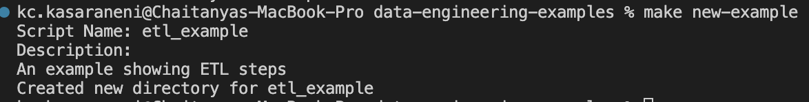

# Contribution Guidelines

Please ensure your pull request adheres to the following guidelines:

- Search previous examples before making a new one, as yours may be a duplicate.
- Make sure your list is useful before submitting. That implies it having enough content and every item a good succinct description.
- A link back to this list from yours, so users can discover more lists, would be appreciated.
- Make an individual pull request for each suggestion.
- Run the command `make new-example` which sets up an individual folder with a README.md file for the example you want to contribute.
   
- If you would already have an example as a repo and would like to add it here, just add it in the `README.md` under your example folder
- Check your spelling and grammar.
- Make sure your text editor is set to remove trailing whitespace.
- The pull request and commit should have a useful title.

## Pull Request Process
1. Run `make new-example` command
2. Add your code/link to your repo for the example
3. Update the README.md under example specific directory with details about your example.
4. Verify and update description in the main README.md (which is automatically generated)
5. You may merge the Pull Request in once you have the review of at least one code owner, or if you do not have permission to do that, you may request the them to merge it for you.